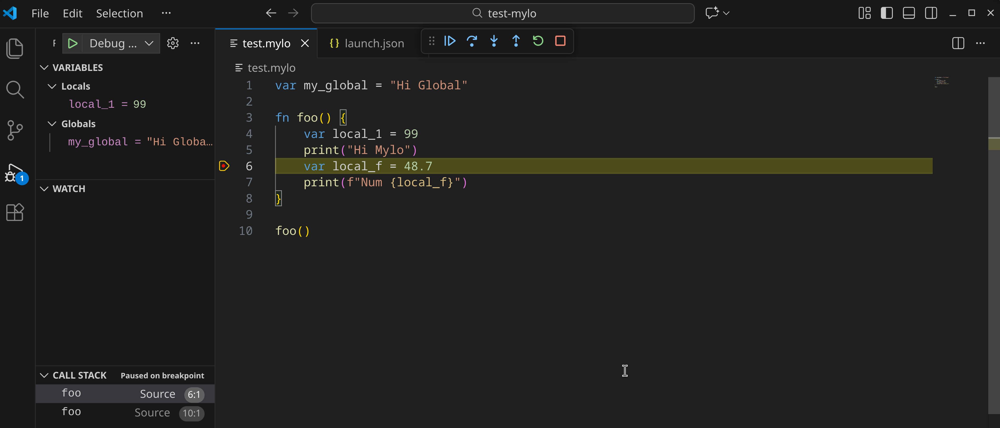

# Mylo

Mylo is an experimental language implemented in C, that uses a simple VM and has cool syntax. It has almost seamless C-interoperability.
Like a sausage dog, it is not serious, but it is cool.

#### 🦗 Mylo is alpha, so expect bugs.

Check out the [Language Reference](docs/mylo_reference.md).

## Hello Mylo
Here is `hello.mylo`:
```javascript
print("Hello Mylo")
```
We can run it like this:
```shell
> ./mylo hello.mylo

Hello Mylo
```

## Something a bit more complex
Here is fib.mylo:
```javascript
fn fib(n) {
  if (n < 2) {
    ret n
  }
  // Recursively call fib
  ret fib(n - 1) + fib(n - 2)
}
print("Calculating Fib(10)...")
var result = fib(10)
// With string interpolation
print(f"result : {result}")
```
Here's the ouput
```shell
> mylo fib.mylo
Calculating Fib(10)...
result : 55
```

## Running a Mylo program

#### With the interpreter
```bash
> ./mylo my_program.mylo
```
#### Something more complicated
```bash
Mylo Language v0.2.0
A lightweight, embeddable language.                                                                                                                                                                                                                                                                                       
                                                                                                                                                                                                                                                                                                                          
USAGE:                                                                                                                                                                                                                                                                                                                    
mylo [flags] [file]                                                                                                                                                                                                                                                                                                       

FLAGS:
  --repl          Start the interactive Read-Eval-Print Loop.                                                                                                                                                                                                                                                             
  --version       Display the current version information.
  --help          Show this help message.
  --debug         Enable DAP debugging
  --trace         Run as normal but print every VM state change
  --build         Build and generate a .c bootstrapping source file.
  --bind          Generate a .c source file binding for later interpreted or compiled dynamic linking
  --dump          Dump the generated bytecode instructions.

EXAMPLES:
  Run a script:                                                                                                                                                                                                                                                                                                           
    ./mylo script.mylo                                                                                                                                                                                                                                                                                                    

  Start REPL with debug mode:
    ./mylo --repl                                                                                                                                                                                                                                                                                                         

  Build a native application (with or without inline C Code):
    ./mylo --build my_file.mylo                               <-- Produced out.c                                                                                                                                                                                                                                          
     cc out.c src/vm.c src/mylolib.c -o mylo_app -Isrc -lm    <-- Uses GNU / C Compiler to build native Executable                                                                                                                                                                                                        
    ./mylo_app                                                <-- Runs like any other executable, with bundled VM.                                                                                                                                                                                                        
                                                                                                                                                                                                                                                                                                                          
  Dynamically or Statically Use C Code:                                                                                                                                                                                                                                                                                   
    ./mylo --bind test_lib.mylo                                  <-- Contains C blocks, this outputs test_lib.mylo_bind.c                                                                                                                                                                                                 
    cc -shared -fPIC test_lib.mylo_bind.c -Isrc -o test_lib.so   <-- Produced a shared object which can be dynamically imported                                                                                                                                                                                           
  Then inside your mylo applications:                                                                                                                                                                                                                                                                                                                                                                                                                                                                                                                                                                                                         
    import native test_lib.mylo        <-- Mylo will look for test_lib.so and load compiled C functions                                                                                                                                                                                                                   
    print(my_cool_c_func())            <-- C functions from shared objects can be run in the interpreter, or compiled.                                                                                                                                                                                                                                                                                                                                                                                                                                                                                                                                                                                                                                   
```

## Building Mylo

### The simple way
```bash
 # Call the c compiler with source, and link math.
> cc src/*.c -o mylo -lm
```
### Using CMake (also builds tests)
```bash
> cmake -B build
> cd build
> make
> ./tests
```

## Debugging in VSCode
Mylo supports the DAP protocol. This can be used with any tool that supports DAP, using the `--dap` flag. There
is a VSCode plugin, in `editors/mylo-vscode` that configures Mylo automatically.



## Debugging in CLI

Mylo supports debugging in the command line using the `--db` flag. The Mylo program will launch and stop at the first line.

```javascript
  SOURCE CODE                                                                                                                                                                                                                                                                                                             
➤    1 │ system_thread("sleep 2 && echo Done", "my_job")                                                                                                                                                                                                                                                                  
     2 │                                                                                                                                                                                                                                                                                                                  
     3 │ forever {                                                                                                                                                                                                                                                                                                        
     4 │     var res = get_job("my_job")                                                                                                                                                                                                                                                                                  
     5 │     if (res == 1) {                                                                                                                                                                                                                                                                                              
     6 │         print("Working...")                                                                                                                                                                                                                                                                                      
     7 │     } else {                                                                                                                                                                                                                                                                                                     
     8 │         print(f"Result: {res[0]}")                                                                                                                                                                                                                                                                               
     9 │         break                                                                                                                                                                                                                                                                                                    
    10 │     }                                                                                                                                                                                                                                                                                                            
    11 │ }                                                                                                                                                                                                                                                                                                                
  VM STATE                                                                                                                                                                                                                                                                                                                
  FP: 0     SP: -1                                                                                                                                                                                                                                                                                                        
  -- Globals --                                                                                                                                                                                                                                                                                                           
    res         : 0                                                                                                                                                                                                                                                                                                       
  -- Locals --                                                                                                                                                                                                                                                                                                            
    (None)                                                                                                                                                                                                                                                                                                                
  mylo-db >
    // Commands:
    // n          Next line
    // s          Step instruction
    // c          Continue
    // b <line>   Set breakpoint
    // p <var>    Print variable
    // set <x> v  Set variable x to v
    // q          Quit
```

## But everything cool is written in C, how do I use those libraries?
### Building a native binary with inline C?
Here is some Mylo code jumping into C and back...
```javascript
// 1. Explicit return: num
var result: num = C(val: i32 = 25) -> num {
    double res = sqrt(val);
    printf("Inside C: sqrt(%d) = %f\n", (int)val, res);
    return res;
}

print(f"Back in Mylo: Result is {result}")
```

For more information, read the FFI section of the reference.

We build it by producing a C source file with embedded VM code and wrapper code pre-generated.

```shell
# This produces an out.c file
> mylo --build example.mylo
```

We then just compile it, like any other C file, but we need to include
the Mylo VM source and headers.
```shell
# This produces mylo_app
>  gcc out.c src/vm.c src/mylolib.c -o mylo_app -Isrc -lm  
```

Our application can then be executed (without a runtime):
```shell
# Run
> ./mylo_app
  Inside C: sqrt(25) = 5.000000
  Back in Mylo: Result is 5
```

## Integration with CMake
Mylo applications can be built, C applications bound, and integrated into other applications
with CMake. There are [docs here.](cmake/README.md)


## Mylo REPL

Mylo can be launched in interpreter mode to evaluate commands from the CLI. It can also be used
to load native dlls and to import other mylo modules.

Launch the Mylo repl with `mylo --repl`. An example can be seen below running in Powershell:

```powershell
PS C:\Users\Brad\Documents\mylo-lang\build> .\mylo.exe --repl
Mylo REPL v0.1.5
Type 'exit' to quit.
> var x = range(20, 2, -2)
> print(x)
[20, 18, 16, 14, 12, 10, 8, 6, 4, 2, 0, -2]
> 
```
