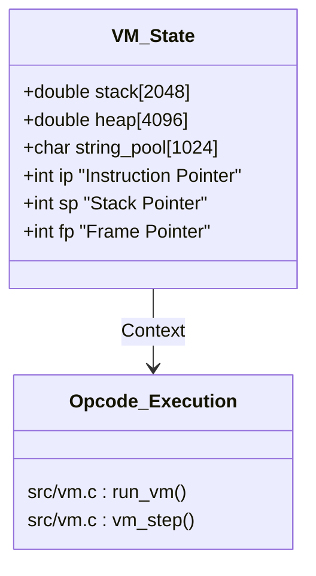
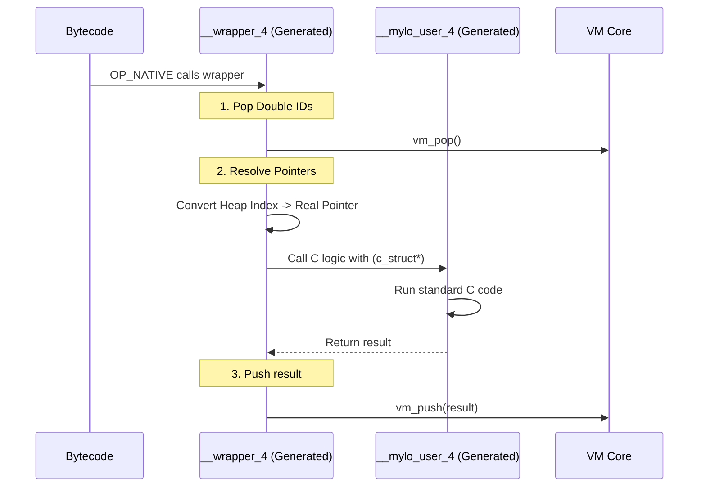

# Mylo Architecture & Internals Reference

## 1. The Virtual Machine (Core Execution)

The Mylo VM is a stack-based, bytecode interpreter optimized for simplicity and embedding. It treats the `double` type as the primitive unit of data storage, even for pointers.

**Key Source File:** `src/vm.c`, `src/vm.h`

### Memory Model
Unlike many VMs that use tagged unions (boxing), Mylo uses a "Nan-Boxing-adjacent" strategy where almost everything on the stack is a raw `double`.

* **The Stack (`vm.stack`)**: A fixed-size array of doubles.
    * *Numbers* are stored directly.
    * *Strings* are stored as the integer ID of the string in the `string_pool`.
    * *Objects* (Arrays, Maps, Structs) are stored as the integer Index into the `heap`.
* **The Heap (`vm.heap`)**: A flat array of `double` used for dynamic allocations.
* **String Pool (`vm.string_pool`)**: A lookup table where strings are deduplicated. The Stack holds indices into this pool.



### Execution Loop
The core loop resides in `run_vm` (or `vm_step`). It relies on a giant `switch` statement over `vm.bytecode`.
* **Reference:** `src/vm.c` (~Line 70)
* **Stack Management:** Macros `vm_push` and `vm_pop` manage `vm.sp`.

---

## 2. The Object System (Heap Layout)

Since the Heap is just an array of `double`, Mylo implements a lightweight object protocol using "Heap Headers".

**Key Source File:** `src/defines.h`, `src/vm.c`

When an object is allocated via `heap_alloc`, it reserves a block of doubles. The first few doubles are metadata.

* **Header 0 (Type):** Indicates the object type (`TYPE_ARRAY`, `TYPE_MAP`, `TYPE_BYTES`).
* **Header 1 (Length/Meta):** Usually the length of the array or capacity of the map.
* **Body:** The actual data follows immediately.

**Code Reference (`src/defines.h`):**
```c
#define TYPE_ARRAY -1
#define TYPE_BYTES -2
#define HEAP_OFFSET_TYPE 0
#define HEAP_OFFSET_LEN 1
```

**Example: Array `[10, 20]` in Heap**


---

## 3. The Compiler (Single-Pass)

Mylo uses a recursive descent parser that emits bytecode directly. It does not generate an Abstract Syntax Tree (AST).

**Key Source File:** `src/compiler.c`

### Pipeline
1.  **Tokenizer:** `next_token()` reads text and populates the `curr` global token.
2.  **Parser:** Functions like `statement()`, `expression()`, and `function()` consume tokens.
3.  **Emitter:** Functions like `emit(OP_ADD)` write directly to `vm.bytecode`.
4.  **Backpatching:** For control flow (`IF`, `FOR`), the compiler emits a placeholder jump, records the address, and "patches" it once the block size is known.

**Code Reference (`src/compiler.c`):**
* `parse()`: Entry point.
* `expression()`: Handles Pratt parsing (precedence) for math.
* `generate_binding_c_source()`: The specialized emitter for `C()` blocks.

---

## 4. The API Bridge & Inline C

This is Mylo's most distinct feature. It allows `C()` blocks inside Mylo code to generate native bindings automatically without external manual wrapping.

**Key Source File:** `src/compiler.c` (Generation), `src/raylib_binding.mylo_bind.c` (Output)

### How it works
1.  **Extraction:** The compiler detects `C(...)` blocks.
2.  **Generation:** It generates a C file (`*_bind.c`) that exports a function `mylo_bind_lib`.
3.  **The API Struct:** To avoid linking errors (since the module is dynamic), the Host Application passes a `MyloAPI` struct containing function pointers to the VM's internal functions (`push`, `pop`, `heap_alloc`).

**The `MyloAPI` Struct (`src/vm.h`):**
```c
typedef struct {
    void (*push)(double, int);
    double (*pop)();
    int (*heap_alloc)(int);
    // ... references to internal VM parts
} MyloAPI;
```

### The Shim Layer
The generated C file creates "Wrappers" that translate VM Doubles into C Types.



---

## 5. Standard Library & Hybrids

**Key Source File:** `src/mylolib.c`

Mylo's standard library supports two types of functions:
1.  **Pure Native:** C functions that manipulate the stack (e.g., `std_sin`, `std_len`).
2.  **Hybrid Functions:** C functions that can execute Mylo Bytecode (e.g., `std_for_list`).

### Hybrid Execution (`for_list`)
This pattern allows high-performance looping in C while calling user-defined logic for each item.

1.  **Save State:** The function saves `vm.ip`.
2.  **Setup Frame:** It pushes `vm.code_size` (Magic Return Address), `vm.fp`, and `Args` onto the stack to mimic a function call.
3.  **Hijack Execution:** It calls `run_vm_from(func_addr)`. The VM runs the user's function.
4.  **Magic Return:** When the user function hits `OP_RET`, it pops the IP. Since the IP is `vm.code_size`, the inner `run_vm_from` loop terminates.
5.  **Restore State:** Control returns to C, which restores `vm.ip` and continues.

**Code Reference (`src/mylolib.c`):**
See `std_for_list` implementation:
```c
// Pseudo-code of the mechanics
int saved_ip = vm->ip;
vm_push(vm->code_size, T_NUM); // Push Magic Exit
vm_push(vm->fp, T_NUM);        // Push Frame
run_vm_from(addr);             // Run Bytecode
vm->ip = saved_ip;             // Restore
```
